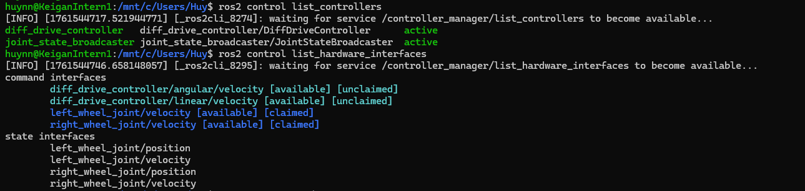

# Hnn Robot

This repo provides a ROS 2 Jazzy meta package for mobile robot platforms that utilize the ros2_control framework for hardware abstraction, control, and simulation. The repo provides high-level launch files that integrate:
- **hnn_robot_description**: Robot URDF/xacro files
- **hnn_robot_control**: Hardware interfaces and ros2_control configuration
- **Navigation**: Navigation configuration, launch files, and maps

A modular **ROS 2 Jazzy** and **Gazebo Harmonic** simulation environment with integrated **ros2_control** support for Hnn robots.  
Easily switch between multiple Hnn robot models within one unified environment for testing and development.

---

## 1. Bringup the Robot

We can bringup a real robot or a simulated robot in Gazebo. Select one of the following options:
### Bringup a simulated robot in Gazebo
```bash
ros2 launch hnn_robot_bringup bringup.launch.py use_gazebo:=true
```

### Bringup a real robot
```bash
ros2 launch hnn_robot_bringup bringup.launch.py use_gazebo:=false
```

### (Optional) Verify ros2_control Setup
Check that the controllers and hardware interfaces are properly loaded:
```bash
ros2 control list_controllers
ros2 control list_hardware_interfaces
```
<p align="center">
  
</p>

### (Optional) Open RViz
```bash
rviz2 -d hnn_robot_bringup/rviz/rviz.rviz
```
<p align="center">
  
</p>

### (Optional) View TF Tree
<p align="center">
  
</p>

### (Optional) Test Robot Motion

**Move Forward:**
```bash
ros2 topic pub -r 10 /diff_drive_controller/cmd_vel geometry_msgs/TwistStamped \
"{header: {frame_id: base_footprint, stamp: {sec: 0, nanosec: 0}}, \
  twist: {linear: {x: 0.3, y: 0.0, z: 0.0}, angular: {x: 0.0, y: 0.0, z: 0.0}}}"
```

**Rotate in Place:**
```bash
ros2 topic pub -r 10 /diff_drive_controller/cmd_vel geometry_msgs/TwistStamped \
"{header: {frame_id: base_footprint, stamp: {sec: 0, nanosec: 0}}, \
  twist: {linear: {x: 0.0, y: 0.0, z: 0.0}, angular: {x: 0.0, y: 0.0, z: 0.6}}}"
```

---

## 2. Run Navigation

**Note:** `use_sim_time` will automatically match `use_gazebo` value. You don't need to set `use_sim_time` separately.

Launch the navigation stack for the simulated robot:
```bash
ros2 launch hnn_robot_bringup navigation.launch.py use_gazebo:=true
# use_sim_time will automatically be set to 'true'
```

Launch the navigation stack for the real robot:
```bash
ros2 launch hnn_robot_bringup navigation.launch.py use_gazebo:=false
# use_sim_time will automatically be set to 'false'
```
---

## Notes

- Ensure all dependencies for **ROS 2 Jazzy** and **Gazebo Harmonic** are properly installed.
- `use_sim_time` automatically matches `use_gazebo` value in navigation launch file. You only need to set `use_gazebo` parameter.
- You can easily extend this simulation to other Hnn robot models by adjusting the launch parameters and configuration files.
- For advanced configurations (e.g., custom controllers or robot URDFs), refer to the `config/` and `xacro/` directories.

---

## Requirements

- **ROS 2 Jazzy**
- **Gazebo Harmonic**
- **ros2_control** and **ros2_controllers**
- **Navigation2 (Nav2)**
- **RViz2**

---

## License

This project is licensed under the [MIT License](LICENSE).

---

### Author
**Huynn (huy.nguyenngoc2137@gmail.com)**

---

### Demonstration
<p align="center">
  
</p>

<p align="center">
  
</p>
